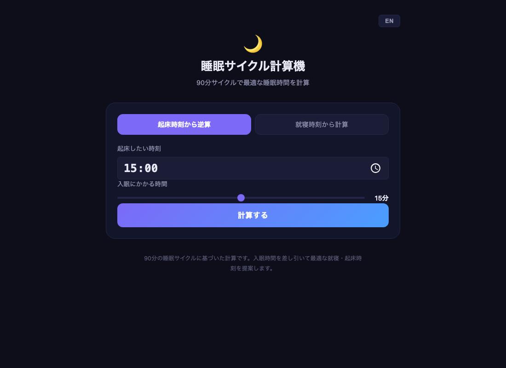

# Sleep Alarm

[](https://sen.ltd/portfolio/sleep-alarm/)

睡眠サイクル計算機。90 分サイクルに基づく最適な就寝・起床時刻を提案。

**Live demo**: https://sen.ltd/portfolio/sleep-alarm/



## 特徴
- 2 modes: bedtime suggestions / wake-up suggestions
- 90-minute sleep cycle calculation
- Configurable fall-asleep time (0-30 min)
- Quality labels (optimal, good, fair)
- Sleep phase visualization
- Japanese / English UI
- Zero dependencies, no build

## ローカル起動
```sh
npm run serve
```

## テスト
```sh
npm test
```

## ライセンス
MIT. See [LICENSE](./LICENSE).

<!-- sen-publish:links -->
## Links

- 🌐 Demo: https://sen.ltd/portfolio/sleep-alarm/
- 📝 dev.to: https://dev.to/sendotltd/a-sleep-cycle-calculator-that-accounts-for-fall-asleep-time-1llj
<!-- /sen-publish:links -->
